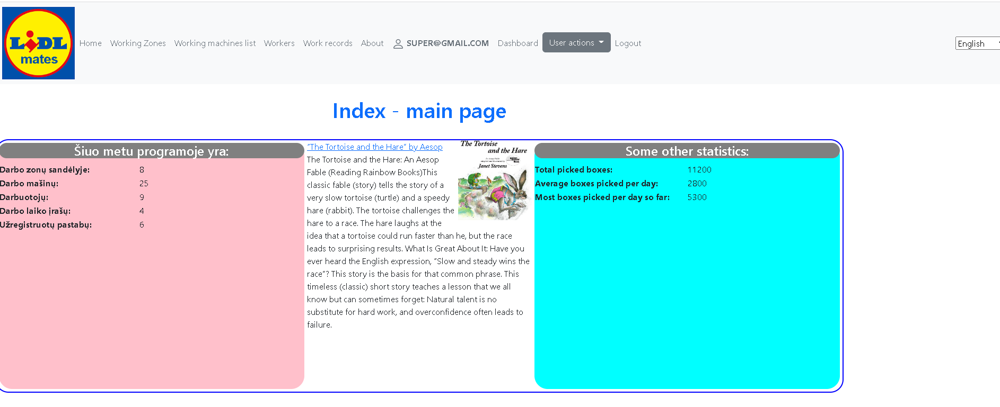
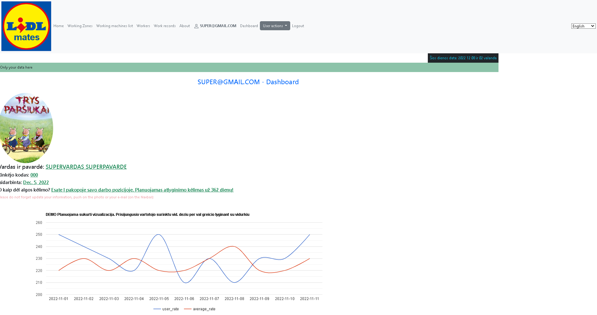
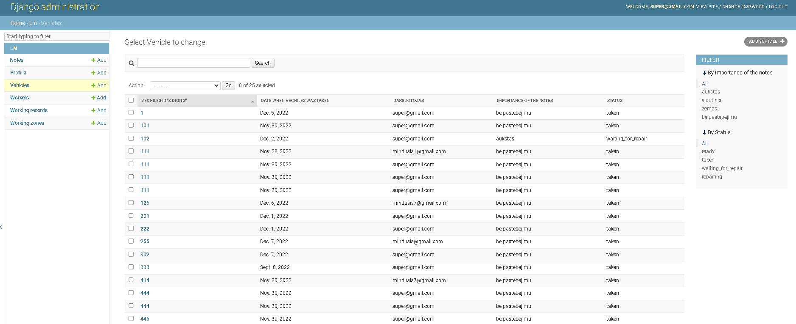

# vigi25-projektas
Programos pavadinimas LIDL Mates (trumpinys app "lm"). Programa skirta visiems darbuotojams.

# Introduction
- Iki šiol dirbu LIDL įmonėje ir kartu su kolegomis pasigendame tam tikrų mažų palengvinimų, kurias ir ne tik jas pasistengsiu 
įgyvendinti keliais programos įgyvendinimo etapais. Planuojama programa bus aktuali ne tik darbuotojams, bet ir vadovams.

- Įkelta programa yra tik maža dalis to ką planuojama. Yra sukurta pilna vizija, kaip turėtų funkcionuoti programa.
Ši versija yra skirta labiau administratoriui, **tokį darba šiuo metu dirbu**, todėl pirmiausia orientavausi į šią dalį. 
Administratorius gali suvesti reikiamus darbuotojus, darbo mašinas, darbo įrašus ir panašiai.
paprastas vartotojas lyginant su neprisijungusiu vartotoju dar neturi planuojamų programos fukcionalumų, viena jų Dashboard'e matoma diagrama - tik kodas su statiniais duomenimis ir veikiančia grafiku leis pamatyti kaip atrodys būsima vartotojo aplinka.

- LOGINS
* ADMIN:
   - user: super@gmail.com
   -  psw: 123
* ORDINARY_USER:
   - user: mindusis@gmail.com
   -  psw: 123

# Getting Started

1. Installation process 
   * Galima nukopijuoti repozitorija į savo kompiuterį Code->Download ZIP arba Clone.  
   * Python interpretatoriaus rekomenduojamas v3.10
   * Pycharm terminale    pip install -r requirements.txt
   * norint dirbti su vertimais reikalinga instaliuoti:
        - https://mlocati.github.io/articles/gettext-iconv-windows.html
        - https://poedit.net/

2. Run APP 
* terminale rašome          "cd mysite"
* terminale rašome po to    "python manage.py runserver"     (dar galima  dėti tarpą ir prirašyti 5000 arba 8000 arba 8080)
* paspaudę ant nuorodos būsite nukreipti į tinklapį

* paspaudus "Prisijungti" (arba pakeitus  ENG  "Login") ir suvedę [super@gmail.com ir 123]  atsidarys papilomos opcijos vartotojui: pagrindinė informacija, visi jo duomenys (Profilis - su galimybe keisti duomenis), vartotojo veiksmai: įvesti naują krautuvą, peržiūrėti jau skurtus įrašus ir pan.

* ADMIN aplinka: interneto naršyklėje suveskite  [pvz : 127.0.0.1:8080/admin/] ir jei nesate prisijungęs kaip ADMIN, teks suvesti aukščiau nurodytus (user/psw)  
galėsite ne tik naršyti, filtruoti, bet ir įvesti duomenis.

# EXTRA

  <h4> Darbą atliko: CodeAcademy kursų  VIGI_25 grupės studentas **Mindaugas Grikšelis**.
      Esu dar labai pradedantysis programuotojas, mielai priimčiau visas pastabas <a href="mailto:mindaugas.grikselis@gmail.com? subject=LIDL mates">e-mail</a> ir/arba <a href="https://www.facebook.com/mindaugas.grikselis/?viewas=100000686899395&show_switched_toast=0&show_invite_to_follow=0&show_switched_tooltip=0&show_podcast_settings=0&show_community_transition=0&show_community_review_changes=0&show_community_rollback=0&show_follower_visibility_disclosure=0" target="_new">FB</a>.
      2022-12-07 Kaunas</h4>
 
<ul> Programos versija 0.41</ul>
<small> p.s. ir žinoma didelis dėkui Žmonai Gabrielei, ką tik gimusiai pirmagymei Mortai ir dėstytojai Džordanai</small>

.
