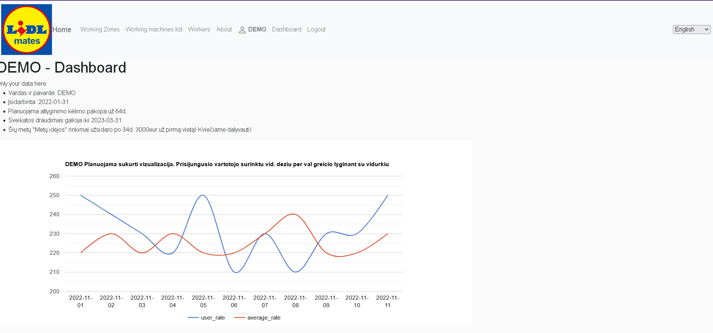
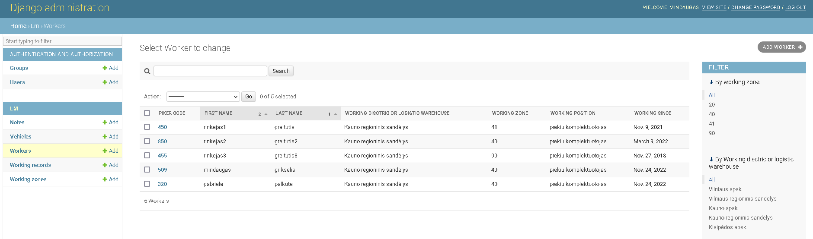

# vigi25-projects
Repozitoriumas VIGI25 individualiems projektams

# Introduction
- Iki šiol dirbu LIDL įmonėje ir kartu su kolegomis pasigendame tam tikrų mažų palengvinimų, kurias ir ne tik jas pasistengsiu 
įgyvendinti keliais programos įgyvendinimo etapais. Planuojama programa bus aktuali ne tik darbuotojams, bet ir vadovams.

- Įkelta programa yra tik maža dalis to ką planuojama. Yra sukurta pilna vizija, kaip turėtų funkcionuoti programa.
Ši versija yra skirta labiau administratoriui, **tokį darba šiuo metu dirbu**, todėl pirmiausia orientavausi į šią dalį. 
Administratorius gali suvesti reikiamus darbuotojus, darbo mašinas, darbo įrašus ir panašiai.
Demo vartotojas lyginant su neprisijungusiu vartotoju galės pamatyti kaip atrodo būsima vartotojo aplinka.

- LOGINS
* admin:
   - user: mindaugas
   -  psw: 123
* demo:
   - user: demo
   -  psw: 123

# Getting Started

1. Installation process 
   * Galima nukopijuoti repozitorija į savo kompiuterį Code->Download ZIP arba Clone.  
   * Python interpretatoriaus rekomenduojamas v3.10
   * Pycharm terminale    pip install -r requirements.txt
   * norint dirbti su vertimais reikalinga instaliuoti:
        - https://mlocati.github.io/articles/gettext-iconv-windows.html
        - https://poedit.net/

3. Run APP 
* terminale rašome          "cd mysite"
* terminale rašome po to    "python manage.py runserver"     (dar galima  dėti tarpą ir prirašyti 5000 arba 8000 arba 8080)
* paspaudę ant nuorodos būsite nukreipti į tinklapį
* paspaudus prisijungti ir suvedę demo user/psw - papulsite į tinklapį, o pasirinkę vartotojo aplinka  (EN - Dashboard) papulsite į Demo aplinką 

* interneto naršyklėje parašę /admin [pvz pilnai atrodo 127.0.0.1:8080/admin/] pateksite į admin login, suvedę aukščiau nurodytus (user/psw)  
* galėsite ne tik naršyti, filtruoti, bet ir įvesti duomenis.
* 

# EXTRA

  <h4> Darbą atliko: CodeAcademy kursų  VIGI_25 grupės studentas **Mindaugas Grikšelis**.
      Esu dar labai pradedantysis programuotojas, mielai priimčiau visas pastabas <a href="mailto:mindaugas.grikselis@gmail.com? subject=LIDL mates">e-mail</a> ir/arba <a href="https://www.facebook.com/mindaugas.grikselis/?viewas=100000686899395&show_switched_toast=0&show_invite_to_follow=0&show_switched_tooltip=0&show_podcast_settings=0&show_community_transition=0&show_community_review_changes=0&show_community_rollback=0&show_follower_visibility_disclosure=0">FB</a>.
      2022-11-27 Kaunas</h4>
 

<ul> Programos versija 0.17</ul>
<small> p.s. ir žinoma didelis dėkui Žmonai Gabrielei, ką tik gimusiai pirmagymei Mortai ir dėstytojai Džordanai</small>

.
